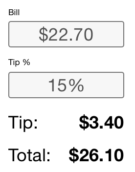
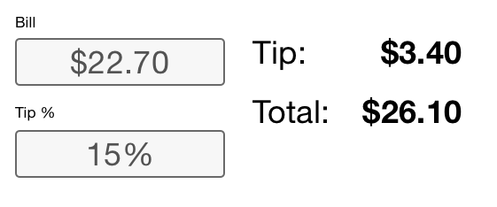
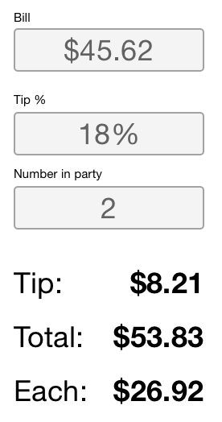
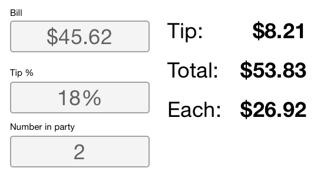
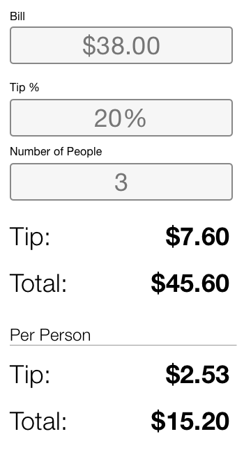
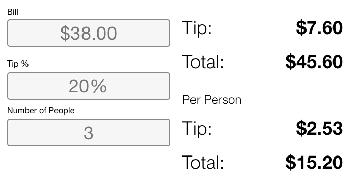
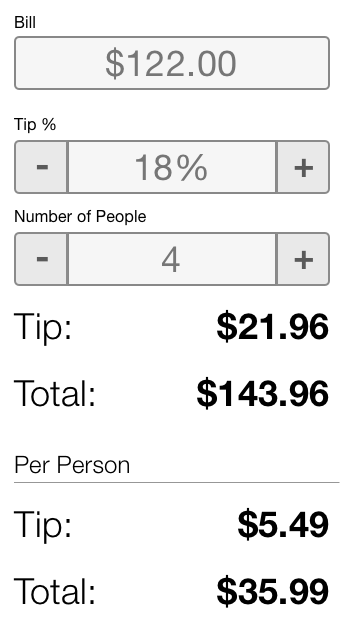
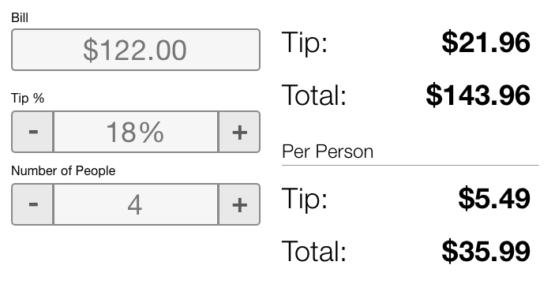

# WEB 1.0 - Tip Calculator

## Description 

This is an introductory assignment for learning JavaScript. The goal is to build a tip caclulator similar to [this one](https://www.google.com/search?q=tip+calculator&oq=tip).

### Why this assignment?

This assignment introduces core concepts used in programming with JavaScript. 

- Using event listeners
- Describe the DOM
- Use methods to access DOM elements
- Use JavaScript functions and operators

## Project requirements

Your goal is make a tip calculator. Take a look at [this one](https://www.google.com/search?q=tip+calculator&oq=tip):


Play with this, calculate a few tips. What happens? How are the values calculated and displayed?

**Your goal is write a program that emulates this tip calculator.** You'll need to do the following:

1. Create markup for the calculator, your markup will become the structure of the DOM which represents the user interface.
1. Create CSS styles that will determine how the user interface is presented and what it looks like.
1. Write JavaScript to define the functionality and logic that makes the tip calculator calculate and display tips. 

In order to accomplish this task, I have broken it up into 6 challenges. **Follow the challenges below to build your tip calculator.**

**NOTE:** _You should plan on doing a minimum of 1 Git commit for each challenge!_ This will help you keep track of each milestone, and gives you a way to revert in case you need to!

### Challenge 1

**Create the markup for the tip calculator.**

- Create an HTML file
  - Name this file index.html
  - It should be in the root of your project folder
- Write the base HTML document tags 
- Add tags and HTML markup for calculator elements. Be sure to set the appropriate attributes on each of these elements. 
  - Bill - element: `<input>`
    - Attributes: `id`, `class`, `type`, `placeholder`
  - Tip - element: `<input>`
    - Attributes: `id`, `class`, `type`, `placeholder`
  - Number of people - element: `<input>`
    - Attributes: `id`, `class`, `type`, `placeholder`
  - Display tip - element: could be `<h1-6>`, `<p>`, `<span>`, `<div>`, or `<output>` you decide!
    - Attributes: `id`, `class`
  - Display total - element: `<h1-6>`, `<p>`, `<span>`, `<div>`, or `<output>` you decide!
    - Attributes: `id`, `class`

This is a general guide to the markup you might use. It covers the elements you'll need to get the tip calculator functioning. You may want to use more tags to help you with layout or add some other features. 

Besure to research the tags and the attributes listed to find out what values these expect and what purpose the attributes serve. 

### Challenge 2

**You'll need to add attributes to the tags.** 

The inputs should have `type="number"`. You can also include a `min`, `max` and `step` attribute! Look these up and think about what appropriate values might be in the context of the tip calculator. 

https://developer.mozilla.org/en-US/docs/Web/HTML/Element/input/number

All of the tags that need to be accessed by your JavaScript code *should have an id*. Remember all *id values should be unique!* 

When writing the `id` names you'll be repeating these names in your JS code so it would be a good idea to have a naming convention. Kebab case is a good choice for id names: `kebab-case`. All characters are lowercase and hyphen (-) is used at word breaks. 

- `input-bill`
- `input-tip`
- `input-people`
- `display-tip`
- `display-total`

Class names will be used for CSS styles. Apply some class names to elements. Again kebab-case should be used here! 

### Challenge 3

**Add a script tag to the bottom of the body.** This should be below all of the other tags but inside the body element. 

```html
  ...
  <script>
    // Your code here...
  </script>
</body> <!-- Closing body tag! -->
</html>
```

### Challenge 4

**Define variables for each of the elements.** You'll be creating references to DOM elements and storing them in variables in this step. Decide on a naming convention and follow it for all elements!

Get the reference to the DOM element using `document.querySelector('#id-name')`

**Note!** The string argument to `querySelector()` is a CSS selector! This can be any CSS selector. The one difference here is `querySelector()` returns a single DOM element. If your selector would find more than one element `querySelector()` returns only the **first** element matching the selector! To return a list of elements use: `querySelectorAll()`. 

Use a naming convention for these variables, as you'll need to keep track of them, use `camelCase`. For example:

```js
const billInput = document.querySelector('#bill')
...
```

- `billInput`
- `tipInput`
- `peopleInput`
- `displayTip`
- `displayTotal`

### Challenge 5

**Add listeners to each of the input fields.** These listeners should listen for the `input` event. A `input` event occurs when data input is detected at an element. As a user enters text or numbers, as each new character is entered the handler for this event is executed. For example: 

```JS
// Handle an event with an anonymouse function
billInput.addEventListener('input', function(e) {
  ...
})
```

or 

```JS
// Handle an event with a named function
billInput.addEventListener('change', handleBill)

function handleBill(e) {

}
```

When an input occurs you'll want to calculate the new tip amount and bill total. To do this you will need to get the values for the following:

- tip percentage
- bill amount
- the number of people

You need to get these values each time there is an input event! Whenever an input occurs the values entered may have changed you should read the values currently stored by each input element to get the most recent values!  

To get the current value entered in an input use `el.value` (I used el as short for *element*). Here is example to get the value for the `tipInput`:

```js 
const percent = tipInput.value
```

When you get a value like this from an input *it will always be a string*, even if the input type is number. Use `parseInt()` or `parseFloat()` to convert a string to an integer or a float. For example:  

- `parseFloat(percent)` - for decimal values like the bill
- `parseInt(party)` - for whole numbers like number of people

**Note!** JavaScript only has the Number type! This type represents both integers and floating point numbers! 

For example: 

```js 
const percent = parseInt(tipInput.value)
```

After this you need to get the bill, tip, and number of people to calculate the tip. Calculate the tip using something like the following: 

```JS 
const tip = bill * percent / 100
const total = bill + tip
const perPerson = total / party
```

### Challenge 6

Last, display the tip and the total. You can do this by setting the `innerHTML` of the element. For example: 

```JS
displayTip.innerHTML = tip
```

The final value mya not be what you expect. For some input values you will see numbers like: 

```
16.240000000000002
```

This is not an error. It is an inherent side affect to the computers conversion of binary numbers to the base 10 numbers that we use. 

To solve this use the `toFixed()` method. This this method rounds a number off to a set number of decimal places and *converts it to a string!* For example: 

```JS
1.61803398875.toFixed(3) // "1.618"
const pi = 3.14159265359
const pie = pi.toFixed(2) // "3.14"
```

Notice that you call `toFixed()` on any number! We would say it's a method of number! 

### Challenge 7

Style your tip calculator. Add a stylesheet. You can get creative here! Take a look at the images here and try and emulate these layouts with Flex and or Grid.

Use flex and direction column.



Grid, and or Flex together. 



## More Challenges

Try these stretch challenges. 

### Split the bill

Add an input for the number of people in the party. Display both the total and the cost per person. Your finished work might look like this: 

 



### Show the split of the tip

Show the cost of the tip split between the party. The output should already be displaying the total bill and the amount of the tip. Add a field to input the number of people in the party. Then display the cost per person and the amount of the tip per person. 

Here are a couple images:

 



### Add some buttons

Look at the [Google tip Calculator](https://www.google.com/search?q=tip+calculator&oq=tip). Notice the buttons to the left and right of each field. These allow us to increment the tip and the number of people in the party. 

You can add some buttons, give these each an id, make a reference, and add a listener to each button. Use `click` event! 

You can style the buttons. Set all of the standard styles: `font-size`, `padding`, `border`, and `border-radius` etc.

 



### Add a menu to select common tip amounts

Add a menu below the tip input that allows us to choose common numbers like:

- 15%
- 18%
- 20%

### Deliverable

Your Completed Tip Calculator should be on GitHub. Submit your GitHub repo to Gradescope!
