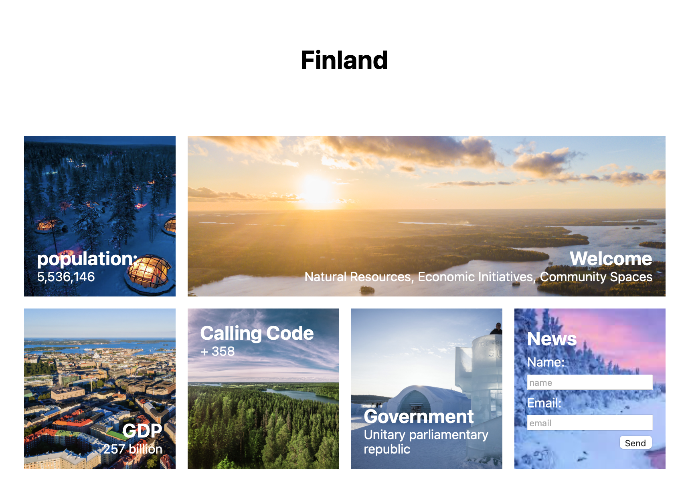

# Lab 3

Imagine you're applying for a job as a frontend web developer. You will need to understand CSS. Flex box and Grid. 

Finland is hiring developers! They need a web site! Your goal is create the page below from the markup provided. 



## Grid Layout

The page is arranged in a grid with 4 columns. One of the cells spans three columns. You can consider this to have 3 rows. The first row contains only the title of the page. 

The container element has the class name `dashboard`. Give this a width of 800px and a height of 600px.

## Background images

Notice that each of the cells has a background image. Use the `background-image` property. Use the `background-size` property with value: `cover` to fit the images into the cells. Each cell has a unique class name!   

## Arranging cell contents with flex

The content of each cell is arranged with flex. Use `display: flex` on each cell. Luckily each cell uses a class name! 

Looking at the image you'll see the contents of each cell is arranged in a column. Use `flex-direction: column` for each grid cell. 

Looking at closely at the cells you'll see that each cell arranges the content differently. Some place the content at the top others at the bottom. Use `justify-content` to arrange the elements at top `flex-start` or the bottom `flex-end`. 

Notice some of the cells align elements to the left or the right. This is the cross axis. Use the `align-items` property. Use `flex-start` to move them to the left and `flex-end` to push them to the right. 

## Images

These beautiful images from wonderful Finland are [here](images/lab-3.zip). 

## Page markup

Use the markup below:

```HTML
<!DOCTYPE html>
<html>
<head>
  <title>Finland</title>
  <style>
    
  </style>
</head>
<body>
  <div class="dashboard">
    <h1 class="title">Finland</h1>

    <div class="population grid-cell">
        <h2>population: </h2>
        <p>5,536,146</p>
    </div>
    
    <div class="welcome grid-cell">
      <h2>Welcome</h2>
      <p>Natural Resources, Economic Initiatives, Community Spaces</p>
    </div>

    <div class="gdp grid-cell">
      <h2>GDP</h2>
      <p>257 billion</p>
    </div>

    <div class="code grid-cell">
      <h2>Calling Code</h2>
      <p>+ 358</p>
    </div>

    <div class="govt grid-cell">
      <h2>Government</h2>
      <p>Unitary parliamentary republic</p>
    </div>

    <div class="news grid-cell">
      <h2>News</h2>
      <label for="name">Name:</label>
      <input id="name" type="text" placeholder="name"/>
      <label for="email">Email:</label>
      <input id="email" type="email" placeholder="email"/>
      <button>Send</button>
    </div>

  </div>
  
</body>
</html>
```
